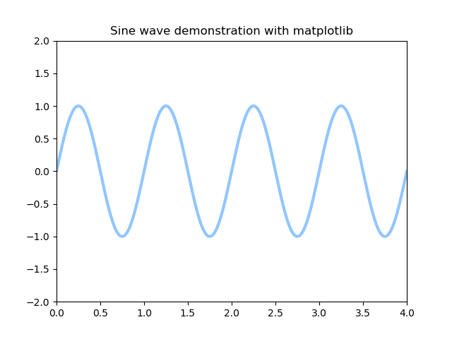

# Question #2

In this question we expect you to write a *Desktop Application*.

## Recommended Tools

1. `Pyqt5`
2. `pyqtgraph` or `matplotlib`

### Bouns Score:

Adding Zoom functionality to the graph.

## Sending Instruction.

Please fork flowing repo and modify it as needed. then send an email to
*nikneshan* at **baregheh.com**. for code review

Regards

